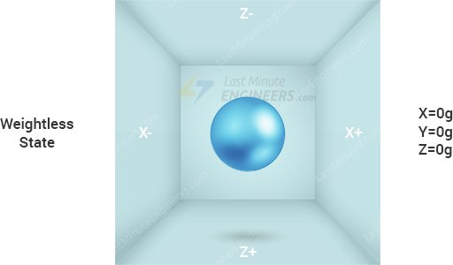
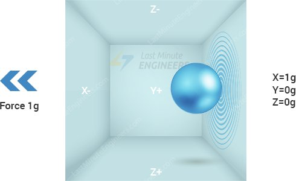
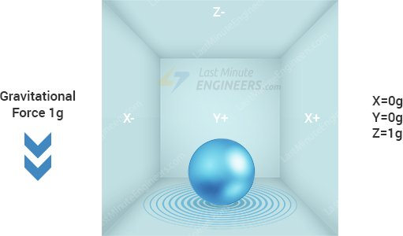
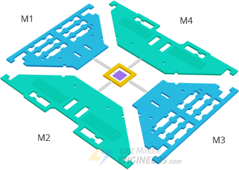
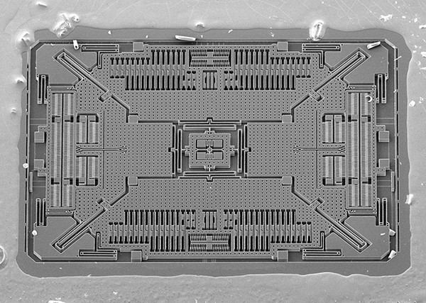
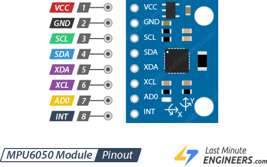
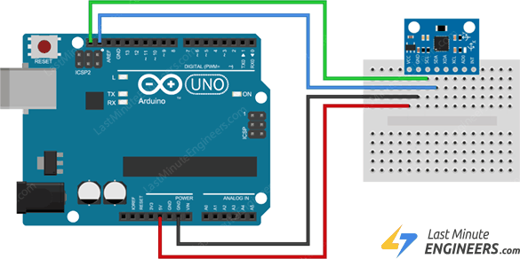

# Accelerometer and Gyroscope Sensor

## How Does an Accelerometer Work?

- To understand how accelerometers work,imagine a ball inside a 3D cube.

- Assuming that the cube is in outer space,where everything is weightless,the ball will simply float in the center of the cibe.
- Now assume that each wall represents a specific axis.
- If we suddenly move the box to the left with acceleration 1g (a simple G-force 1g is equivalent to gravitational acceleration 9.8m/s2), the ball will undoubtedly hit the wall X.
- If we measure the force the ball exerts on the wall X,we can obtain an output value of 1g along the X axis.

- Let's see what happens when we place thar cube on Earth.
- The ball will simply fall on the wall Z,exerting a force of 1g as shown in the diagram below.

- In this case,the gravity box isn't moving,but we still get a 1g reading on the Z axis.
- This is because gravity (which actually a form of acceleration) is pulling the ball downward with a force of 1g.
- While this module does not exactly reprent how a real-world accelerometer sensor is built,it is often useful in understanding why an accelerometer's output signal is typically specified in + or - g,or why an accelerometer reads 1g in the z-axis at rest,or what accelerometer reading you can expect at different orientations.
- In the real world,accelerometers are based on Micro-Electro-Mechanical Systems(MEMS fabrication technology).
- So,let's find out how a MEMS accelerometer works.

## How does a MEMS accelerometer Work?

- A MEMS(Micro-Electro-Mechanical System) accelerometer is a micro-machined strure built on top of a silicom wafer.

- This structure is suspended by polysilicon springs.
- It allows the structure to deflect when accelerated along the X,Y and Z axes.
- The sensor process this changes in capacitance and converts it into an analog output voltage.

## How deos a Gyroscope Work?

- While accelerometers measure linear acceleration,gyroscopes,measure angular rotation.
- To accomplish this,they measure the force generated by the Coriolis Effect.

### Coriolis Effect

- The Coriolis Effect states that when a mass(m) moves in a specific direction with a velocity (v) and an external angular rate(ohoms) is applied(Red arrow), the Coriolis Effect generates a force(Yellow arrow) that causes the mass to move perpendicularly.
- The value of this displacement is directly related to the angular rate applied.

- Consider two masses oscillating in opposite directions at a constant frequency.
- When an angular rate is applied,the coriolis effect produced by the each mass is in opposite directions,resulting in a proportional changes in capacitance between the masses.
- By measuring this change in capacitance,the angular rate can be calculated.

## How Does a MEMS Gyroscope Work?

- The MEMS sensor consists of a proof mass(consisting of four parts M1,M2,M3 and M4)that is maintained in a continuous oscillating movement so that it can responf to the coriolis effect.
- They simultaneously move inward and outward in the horizantal plane.

- When we begin to rotate the structure,the Coriolis force acting on the moving proof mass causes the vibration to change from horizontal to vertical.
- There are three modes depending on the axis along which the angular rotation is applied.

## Roll Mode

- When an angular rate is applied along the X axis, M1 and M3 will move up and down out of the plane due to the coriolis effect.
- This causes a changes in the roll angle,hence the name Roll Mode.

## Pitch Mode

- When an angular rate is applied along the Y-axis M2 and M4 will move up and down out of the plane.
- This causes a change in the pitch angle,hence the name Pitch Mode.

## Yaw Mode

- When an angular rate is applied along the Z-axis,M2 and M4 will move horizontallu in opposite directions.
- This causes a changes in the yaw angle,hence the name Yaw Mode.

- Whenever the coriolis effect is detected,the constant motion of the driving mass will cause a change in capacitance that is detected by the sensing structure and converted into a voltage signal.

## Technical Speacification

- Operating Voltage 5V
- Accelerometer Range + or - (2,4,8,16)
- Gyroscope Range + or - (250,500,1000,2000)s
- Tempurature Range (-40 to 85)C
- Absolute Maximum Acceleration Up to 10,000g

## Pinout

## Wiring Diagram of Circuit

