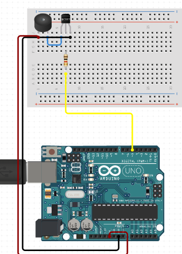

# Active Piezo Buzzer Module

## Introduction

- The Active Piezo Buzzer Module is a type of piezoelectric buzzer that only requires a DC voltage to produce sound. This makes it easy to use in electronics projects, such as alarms or notifications, or even programmed to produce musical notes when connected to an Arduino.

## Image

## How to connect to a circuit

To connect an Active Piezo Buzzer Module to an Arduino circuit, follow these steps:

- Connect the positive (red) wire of the buzzer to a digital pin on the Arduino.
- Connect the negative (black) wire of the buzzer to a GND pin on the Arduino.
Here's an example circuit diagram:

yaml
Copy code
          +5V
           |
           -
           |
         Digital
          Pin
           |
          Buzzer
           |
         GND

## The theory behind the components

- The Active Piezo Buzzer Module contains a coil of wire connected to the buzzer's pins, surrounded by a round magnet. A thin metal film with a metal weight attached to the top sits above the round magnet and wire coil. When pulses of current are applied to the wire coil, magnetic inductance causes the metal weight and metal film to vibrate up and down. The vibration of the metal film produces sound waves.

## Features

Some features of the Active Piezo Buzzer Module include:

- Only requires a DC voltage to produce sound.
- Can be used in a variety of electronics projects, such as alarms, notifications, or programmed to produce musical notes.
- Easy to connect to an Arduino circuit.

## Statistics

 Some technical specifications of the Active Piezo Buzzer Module include:

- Operating Voltage: 3-5V DC
- Sound Output: >85dB
- Resonant Frequency: 2300 ± 300 Hz
- Operating Current: <30mA
- Operating Temperature: -20°C to +70°C
- Size: 12mm x 9mm x 7.5mm
