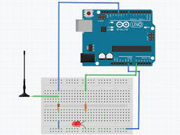

# Electromagnetic Field Sensor

- EMF is an abbreviation for the electromagnetic field.So, an Electromagnetic field detector can detect the electromagnetic field in a Specific region.
- In other words,you can say that an EMF detector can perform EMF measurements.
- An EMF detector detects radiation by examining the non-ionizing radiation emitted by electromagnetic device and household appliences.
- When an EMF detector detects any radiation,it will show a reading that describes the radiation's strength or weakness

| Arduino | Antenna                           | Indicator LED            |
| ------- | --------------------------------- | ------------------------ |
| GRN     |                                   | -ve                      |
| D11     | To Antenna wire with 10k resistor |
| A0      |                                   | To +ve with 220 resistor |

## Applications of EMF Detector

- Electromagnetic field meters
- For identifying issues with power lines and electrical wiring
