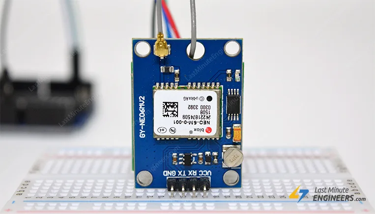
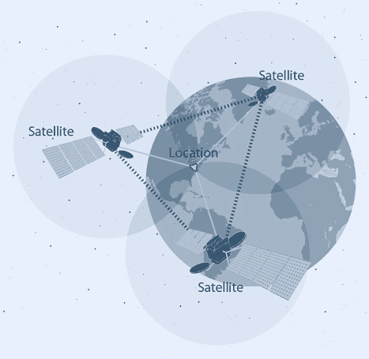
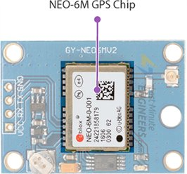
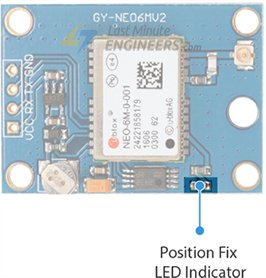
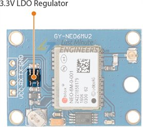
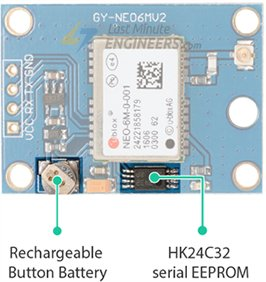
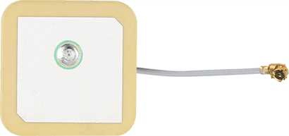
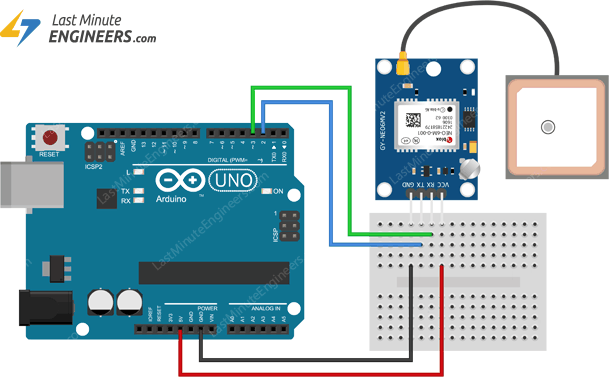

# GSM NEO 6m Module

## How does it works?

- GPS is a system of 30+ navigation satellites orbiting the earth.
- We know where they are in space because they constantly transmit information about their position and current time to Earth in the form of radio signals.

- A GPS receiver listens to these signals.once the receiver calculates its distance from at least three GPS satellites,it can figure out where you are.This process is known as **Trilateration**.

## NEO-6M GPS Chip

- The chip measures less than a postage stamp but packs a supirising amount of features into its tiny frame.

- It can track up to 22 satellitea over 50 channels and achieve the industry's highest level of tracking sensitivity i.e -161 dB. while consuming only 45mA current.
- Unlike other GPS modules,it can perform 5 location updates in a second with 2.5m horizontal position accuracy.The U-blox 6 popsitioning engine also has a Time-To-First-Fix(TTFF) of less than 1 second.

## Position Fix LED indicator

- There is a LED on the NEO-6m GPS module that indicates the status of the 'Position Fix'.It will blink at different rates depending on which state it is in,

  - **No blinking**- it is searching for satellites
  - **Blink every 1s**- Position Fix is found(the module can see enough satellites).

  

## 3.3V LDO Regulator

- The operating voltage of the NEO- 6m chip ranges from 2.7 to 3.6V.
- But the good news is,this module comes with MICREL's MIC5205 Ultra-Low Dropout 3V3 regulator.
- The logic pins are also 5V tolerant,so we easily connect it to Arduino or any 5V logic microcontroller without using a logic level converter.

  

## Bettery and EEPROM

- The module is equipped with HK24C32 Two Wirw serial EEPROM.it is 4KB in size and is connected via 12C to the NEO-6M chip.
- The module also houses a rechargeable battery that acts as a super-capacitor.

  

- EEPROM and bettery together help in retaining the BBR(Battery Backed RAM).
- BBR contains clock data,latest position data(GNSS orbit data) and module configuration.But it is not for permanent data storage.

## Antenna

- The module comes with -161 dBm sensittivity patch antenna for receiving radio signal from GPS satellites.
  

## NEO-6M GPS Module pinout

- The NEO-6M GPS module has a total of 4pins that connect it to the outside world.
  

- GND is the ground pin and needs to be connected to the GND pin on the Arduino.
- TxD pin is used for serial communication.
- RxD pin is used for serial communication
- VCC supplies power to the module. You can connect it directly to the 5V pin on the Arduino.

## Wiring a NEO-6M GPS module to an Arduino

