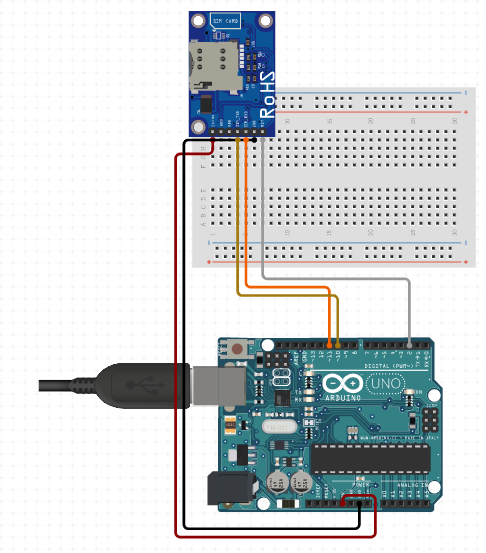

# SIM800L GSM Module

The SIM800L GSM module is a versatile and compact device that allows users to connect to a global GSM network using any 2G SIM card. It can be used for a range of tasks, such as making phone calls, sending SMS messages, connecting to the internet via GPRS, and even receiving FM radio broadcasts.

This module is ideal for embedded projects due to its small form factor and low power requirements, making it an excellent choice for IoT and other battery-powered applications.

## Image

## How to Connect to a Circuit

All of the necessary data pins on the SIM800L GSM chip are broken out to a 0.1" pitch header, including the pins for communication with a microcontroller over the UART. To connect it to a circuit, you can use the following pinout:

- VCC: Connect to a power source ranging from 3.4V to - 4.4V, such as a LiPo battery.
- GND: Connect to ground.
- RST: Can be used to perform a hard reset of the module.
- RxD: Used to send commands to the module.
- TxD: Used to receive data from the module.
- NET: Connect to an external antenna or use the helical antenna that comes with the module.
- RING: Can be used as an interrupt-out pin for when a call or SMS message is received.
- DTR: Can be used to activate/deactivate sleep mode.
- MIC: Used for connecting a differential microphone.
- SPK: Used for connecting a differential speaker.

## Theory Behind the Components

The SIM800L GSM module uses a UART interface to communicate with a microcontroller, allowing it to send and receive commands and data. It requires an external antenna to connect to a cellular network, and a 2G SIM card to operate.

The module can be powered by a range of voltages between 3.4V and 4.4V, making it an ideal choice for battery-powered applications. It also features a range of pins for connecting external components, such as a microphone or speaker.

## Features

- Connect to any global GSM network with any 2G SIM card.
- Make and receive voice calls using an external speaker and electronic microphone.
- Send and receive SMS messages.
- Send and receive GPRS data.
- Scan and receive FM radio broadcasts.

## Statistics

- The SIM800L GSM module is a small and compact device, measuring just 24mm x 24mm x 3mm. 
- It requires a power supply of between 3.4V and 4.4V, and can be connected to a microcontroller using a UART interface with baud rates ranging from 1200bps to 115200bps.

- The module features an LED status indicator that blinks at different rates depending on the module's state, making it easy to diagnose any issues with the device. 
- It also has a range of pins for connecting external components, such as a microphone or speaker.
