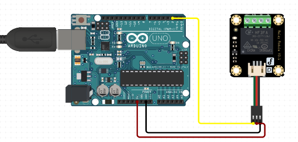

# C0005-Gravity Sensor

## Introdution to gravity sensors:

Gravity sensors, also known as accelerometers, are devices used to measure acceleration due to gravity. These sensors are commonly found in various electronic devices such as smartphones, tablets, fitness trackers, and gaming consoles. They work on the principle of detecting changes in acceleration, allowing the device to determine its orientation and movement.

Gravity sensors can measure the force of gravity acting on the device in multiple dimensions (usually three: x, y, and z axes). By analyzing these measurements, the device can detect its tilt, motion, and vibration. This information is valuable for applications like screen rotation, motion-based gaming, activity tracking, and augmented reality, among others.

In summary, gravity sensors, or accelerometers, are essential components in modern electronic devices, enabling them to sense movement and orientation in three-dimensional space.

## Image

## How to Connect to a Circuit

To use a gravity sensor with Arduino, you need to connect the sensor to the Arduino board and write a program to read the sensor data. Depending on the type of sensor you have, you may need to connect it to the board using pins or a shield. Once you have the sensor data, you can use it to control other parts of your project.

## The Theory Behind the Components

The gravity sensor calculates its values using more than one hardware sensor and provides a three-dimensional vector indicating the direction and magnetic of gravity. The sensor measures the force of acceleration, which can be interpreted as the direction and magnitude of gravity. The sensor uses a piezoelectric material that generates a voltage proportional to the acceleration it experiences.

## Features

- Measurement range: Gravity sensors have a measurement range that specifies the minimum and maximum acceleration values that the sensor can detect.
- Sensitivity: Gravity sensors have a sensitivity that specifies the smallest change in acceleration that the sensor can detect.
- Resolution: The resolution of a gravity sensor is the smallest difference between two acceleration values that the sensor can distinguish.
- Sampling rate: The sampling rate of a gravity sensor is the frequency at which the sensor takes measurements.
- Communication protocol: Gravity sensors typically communicate with a microcontroller or other device using a digital communication protocol such as I2C or SPI.
- Power consumption: The power consumption of a gravity sensor is an important consideration for battery-powered applications.
- Noise level: Gravity sensors are subject to noise from various sources, including temperature variations and electromagnetic interference.

## Statistics

- Limited range
- Limited sensitivity
- Limited accuracy
- Cross-axis sensitivity
- Temperature sensitivity
- Power consumption
- Size and cos
