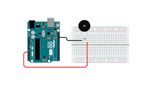

# C0027-Knock Sensor

## Introduction

- A Knock Sensor or a Vibration Sensor is a simple electronic device that detects vibrations or shocks from tapping or knocking it. It is commonly used in automotive engines to detect engine knocking or detonation, but can also be used in other applications such as security systems or home automation.

## Image

## How to Connect to a Circuit

- To interface the Knock Sensor Module with an Arduino Uno, connect the GND pin to the GND pin on the Arduino, the +5V pin to the 5V pin on the Arduino, and the S pin to any digital input pin on the Arduino.

## Theory Behind the Components

- The output pin of the sensor (connected to one end of the switch) is pulled HIGH with the help of a 10K ohm pull-up resistor. Under normal conditions, i.e. when there is no shock or vibration, the output of the Knock Sensor Module is HIGH. When the sensor detects any vibrations or knocks, the vibrating spring (i.e. switch) closes and the output of the sensor becomes LOW.

## Features

- Several types of Knock Sensors are available in the market, with the cheaper ones being called KY-031 Knock Sensors. They are small in size, easy to use, and can be used in a variety of applications.

## Statistics

- As a passive electronic device, the Knock Sensor Module does not consume much power and has a long lifespan. Its sensitivity can be adjusted using a potentiometer on the module, allowing it to detect different levels of vibration or shock.
