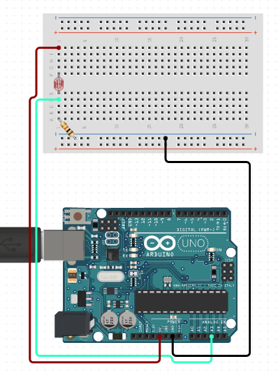

# C0001-Light Sensor

## Introduction

- Light sensor module is used to detect the intensity of light.
- It has both analog output pin and digital output pin labeled as AO and DO respectively on the board.
- This sensor module is designed to detect and measure various physical properties, such as temperature, humidity, pressure, light intensity and more.

## Image

## How to connect to a circuit

- Connect the LDR to the analog input pin 0 on the Arduino board.
- Connect the VCC leg on the sensor to the 5V pin of the Arduino board.
- Connect the GRD leg on the sensor to the GND pin of the Arduino board.
- A connection diagram is provided to illustrate the connections.

## The theory behind the components

- When there is light, the resistance of LDR becomes low according to the intensity of light.
- This means when the light level decreases, the resistance of the LDR increases.
- As this resistance increases in relation to the other resistor, which has a fixed resistance, it causes the voltage dropped across the LDR to also increase.
- Light sensors are a type of photodetector (also called photosensor) that detect light.
- Different types of light sensors can be used to measure illuminance, respond to changes in the amount of light received, or convert light to electricity.

## Features

- The light sensor module has both analog and digital output pins.
- It can be used to detect the intensity of light.
The sensitivity of the sensor can be adjusted using a potentiometer.

## Statistics

- The working voltage of the light sensor module is between 3.3V and 5V DC.
- The detection angle is about 60 degrees.
- The sensor can detect light intensity ranging from 500 to 10,000 lux.
