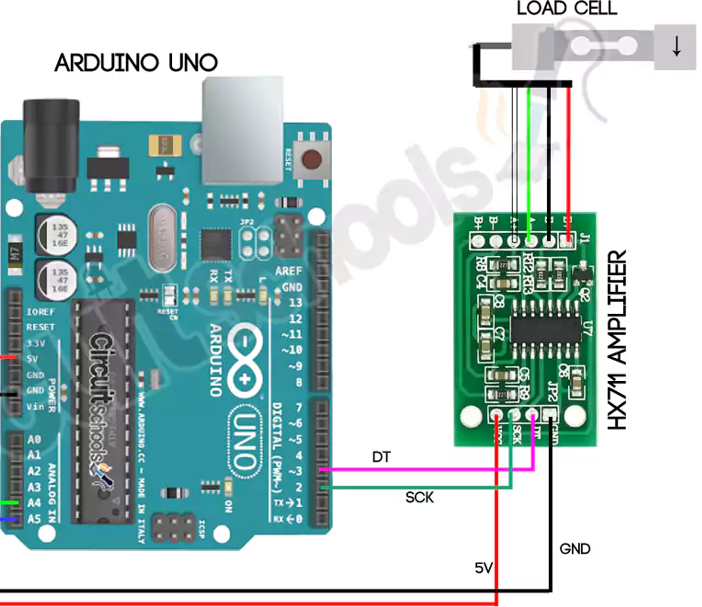

# C0030-Load Cell Sensor

A load cell is a transducer capable of translating pressure or force into an electrical signal. Load cells are used to measure weight and can be found in various devices such as weighing machines, lifts, and cars. There are three types of load cells: hydraulic, pneumatic, and strain gauge based.

## Image

## How to Connect to a Circuit

Load cells can be interfaced with an HX711 load cell amplifier module and an Arduino to measure weight. Here is a circuit diagram of how to connect them:

## The Theory Behind the Components

A strain gauge is a sensor that changes its resistance depending on the pressure exerted on it. Load cells based on strain gauges work by using the strain gauge to relate the force to an electrical signal (voltage) that can be measured. However, the resistance changes can be very small and require amplification. The Wheatstone bridge is a simple circuit that can detect these small variations in resistance.

## Features

- Load cells come in different materials, sizes, and mechanical configurations, which gives each load cell different sensitivities and maximum and minimum measuring capacities.
