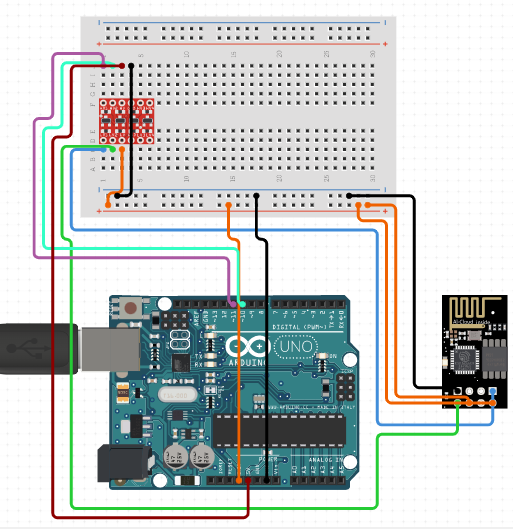

# 0036-MKR1000 Wifi Module

## Introduction

- The MKR1000 Wi-Fi Module is an Arduino board designed to provide makers with a practical and cost-effective solution to add Wi-Fi connectivity to their projects. It has a powerful 32-bit processor, low power Wi-Fi with a Cryptochip for secure communication, and the ease of use of Arduino Software for code development and programming.

## Image

## How to Connect to a Circuit

- The MKR1000 board can be connected to a circuit using a micro USB cable, which is used to connect the board to a computer. The board is shipped with male strip headers that are not mounted, allowing the user to adapt the board to their project by easily soldering them.

## The Theory behind the Components

- The MKR1000 board includes a Li-Po charging circuit that allows it to run on battery power or external 5V, with automatic switching between the two sources. It runs at 3.3V and has a maximum voltage tolerance of 3.3V for its I/O pins, making it different from most Arduino boards. While output to 5V digital devices is possible, bidirectional communication with 5V devices requires proper level shifting. Li-Po batteries are charged at 4.2V with a current that is usually half of the nominal capacity (C/2), and the board is programmed with a charging time of 4 hours, after which it goes into automatic sleep mode.

## Features

- 32-bit computational power
- Low power Wi-Fi with a Cryptochip for secure communication
- Ease of use of Arduino Software (IDE) for code development and programming
- Li-Po charging circuit for battery power or external 5V, with automatic switching
- 8 digital I/O pins, 4 PWM digital I/O pins, 6 analog input pins, and 1 analog output pin
- 256KB flash memory and 32KB SRAM
- Clock speed of 48MHz

## Statistics

- In 2019, an estimated 3 billion Wi-Fi compatible devices were manufactured worldwide, which is approximately 0.4 devices per person per year. The MKR1000 board is recommended to be used with a Li-Po battery of at least 700mAh capacity, as smaller cells may overheat, develop internal gasses, and explode, setting the surroundings on fire. The charging current for the specialized chip used in the board is 350mAh, and the chip is programmed with a maximum charging time of 4 hours, limiting the amount of charge to 1400mAh per charging round.
