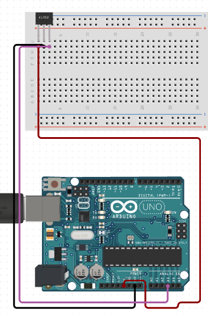

# C0004-Magnetic fields sensor

## Introduction to Magnetic fields sensor:

 A magnetic field sensor, also known as a magnetometer, is a device that measures the strength and direction of a magnetic field. Magnetic field sensors detect and respond to magnetic fields, allowing them to be used in various applications across different industries. Here are some key points about magnetic field sensors:

## 1.Principle of Operation:
Magnetic field sensors operate based on the principles of magnetoresistance or Hall effect. In magnetoresistive sensors, changes in the magnetic field alter the electrical resistance of a material, which can be measured to determine the magnetic field strength. Hall effect sensors, on the other hand, measure the voltage generated when a magnetic field deflects the flow of electrons in a conductor.

## 2.Types of Magnetic Field Sensors:
Hall Effect Sensors: These sensors utilize the Hall effect and are commonly used for proximity sensing, speed detection, and position measurement.
Magneto-Resistive Sensors: These sensors measure changes in electrical resistance due to magnetic fields and are used in applications like magnetic compasses and non-destructive testing.
Fluxgate Sensors: Fluxgate sensors use a closed magnetic loop to measure the magnetic field strength and are often employed in geophysical and navigation instruments.
SQUID (Superconducting Quantum Interference Device): SQUID sensors are extremely sensitive magnetometers used in scientific research and medical applications, such as magnetoencephalography (MEG) to measure brain activity.
**3. ** Applications of Magnetic Field Sensors:

## Navigation:
Magnetic field sensors are used in electronic compasses for navigation in smartphones, cars, ships, and aircraft.
## Consumer Electronics:
They are utilized in devices like gaming controllers and virtual reality systems for motion tracking.
## Industrial Applications:
Magnetic field sensors are used in industrial automation for position sensing, metal detection, and motor control.
## Automotive Industry:
They play a role in various automotive systems, including anti-lock braking systems (ABS) and electronic stability control (ESC).
## Scientific Research:
Magnetic field sensors are used in scientific experiments to study magnetic properties of materials, Earth's magnetic field, and in astronomy and geophysics.
## Security Systems:
They are used in security devices like door and window sensors to detect unauthorized entry.
## Medical Applications:
Magnetic field sensors are used in medical devices like MRI machines and in research for studying the human brain and heart.
Magnetic field sensors are crucial in modern technology, enabling precise measurements of magnetic fields and finding applications in a wide range of fields.

## Image:

## How to Connect to a Circuit:

- To operate a sink sensor like the Honeywell 2SS52M, an external power supply should be connected to the sink through a resistor. When no magnetic field is detected, the sink works as an open switch and no current flows from the power supply to the device.  
- When a magnetic field is detected, the sink acts as a closed switch and some current flows from the external power supply to the device. To determine if the device is sensing a magnetic field, measure the voltage across the resistor. If it is zero, there is no external magnetic field present (apart from the Earth's magnetic field). If a strong enough magnetic field is placed close to the sensor, a voltage should be measurable.

## The Theory Behind the Components:

- The Honeywell 2SS52M is a digital magnetoresistive sensor that detects magnetic fields oriented parallel to the longest side of its package (indicated by the white arrow on the device).
- The sensor is omnipolar, meaning that the orientation of the magnetic field doesn't matter – either a south-north or north-south alignment triggers the device. When the external magnetic field in a given direction is strong enough, the device works as a sink for current. Sink sensors have an output mode that is different from source sensors.
- To operate a sink sensor, an external power supply must be connected to the sink through a resistor.

## Features:

- The Honeywell 2SS52M is a compact device with three pins – GND, VCC, and an output pin.
- It is highly sensitive to magnetic fields and can detect them even when they are weak.
- The sensor is compatible with a variety of electronic devices and can be used in many different applications, such as position sensing, current sensing, and rotational sensing.

## Statistics:

## Sensitivity:
Magnetic fields sensor have a sensitivity rating, typically expressed in millivolts per Gauss (mV/G). This rating indicates how much the sensor's output voltage changes in response to changes in the magnetic field strength.

## Operating Voltage: 
Magnetic fields sensor often work within a specific voltage range, such as 3.3V or 5V, depending on the module and manufacturer.

## Output Type:
Magnetic fields sensor typically provide a digital output (high or low) when a specific magnetic field threshold is reached. Some modules also offer analog output, providing a voltage proportional to the magnetic field strength.

## Maximum Current:
Magnetic fields sensor may have a maximum current rating for the load they can drive. This is important if you're using the sensor to control external devices.

## Response Time: 
The response time of a Magnetic fields sensor is the time it takes to detect changes in the magnetic field and produce an output response. It is typically quite fast.

## Hysteresis:
Some Magnetic fields sensor exhibit hysteresis, meaning they may have slightly different output values for the same magnetic field strength depending on whether the magnetic field is increasing or decreasing.

## Operating Temperature Range:
The sensor's performance can be influenced by temperature, so it's important to consider the operating temperature range if you plan to use it in extreme conditions.

## Mounting Options: 
Depending on the module, Magnetic fields sensor may come in various shapes and sizes, with different mounting options.
