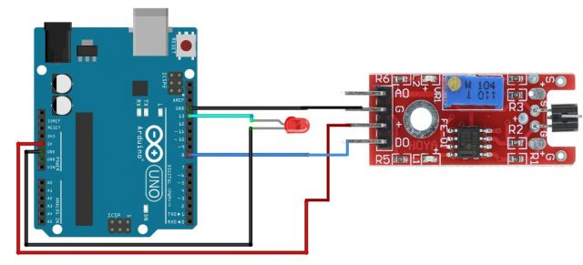

# Metal Touch Sensor

## Introduction

- The KY-036 metal touch sensor module is a simple and easy-to-use touch sensor that detects electrical conductivity.
- It is widely used in various applications such as touch screens, security systems, and power tools.
- This module has an on-board touch sensor, which consists of a potentiometer, six resistors, and two LEDs.

## Image

## How to connect to a circuit

- The KY-036 touch sensor module can be easily interfaced with an Arduino or other microcontrollers. The module has four pins: digital signal, VCC +V, ground, and analog signal.
- The digital signal pin can be connected to a digital pin on the microcontroller, and the analog signal pin can be connected to an analog input pin.  - The VCC +V pin should be connected to a 3.3V or 5V power supply, and the ground pin should be connected to the ground of the microcontroller.

## The theory behind the components

- The KY-036 touch sensor module features a Darlington and PN transistor, which are controlled by an LM393 comparator IC that consists of two comparators. When the bar wire over the transistor is touched, the signal is controlled by the comparator.
- The 50Hz AC signal in a modern home or office is  injected into a high-gain amplifier, and the output of this amplifier is connected to the comparator. The AC signal is then converted to a square wave. The sensitivity of the sensor can be adjusted by adjusting the trimmer.

## Features

The KY-036 touch sensor module has the following features:

- Power supply: 3.3V or 5V
- Adjustable sensitivity
- Analog and digital output
- Packaging: antistatic sealed bag
- Dimensions: 34x16 mm
- Built-in LEDs to indicate power and detection

## Statistics

The resistors used in the KY-036 touch sensor module are as follows:

- R1: 10 kΩ
- R2: 100 kΩ
- R3: 150 Ω
- R4: 1 kΩ
- R5: 1 kΩ
- R6: 100 kΩ
- The resistors are used to limit the current from burning the module. The LED L1 in the module lights up to show if the module is working properly, and the LED L2 lights up every time the sensor is touched.
- The sensor can be used in various applications such as touch screens, security systems, and power tools.
