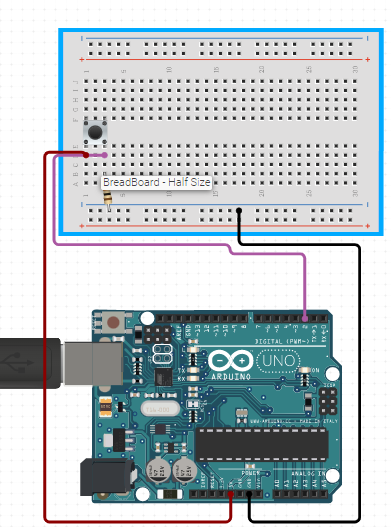

# Push Button Module

The push button module is an Arduino compatible sensor that allows you to control your Arduino project with the press of a button. It is a simple input device that can be used in a variety of projects.

## Image

## How to Connect to a Circuit

To connect the push button module to an Arduino circuit, follow these steps:

- Connect the VCC pin to the 5V pin on the Arduino.
- Connect the GND pin to the GND pin on the Arduino.
- Connect the OUT pin to any digital pin on the Arduino.

## Theory Behind the Components

The push button module consists of a simple push button switch that can be used to provide digital input to an Arduino. When the button is pressed, it connects the OUT pin to the GND pin, causing a digital signal of 0 to be sent to the connected digital pin on the Arduino. When the button is released, the connection is broken and a digital signal of 1 is sent to the connected digital pin.

## Features

- Push button switch suitable for Arduino projects
- Digital switch output (0 and 1)
- Compatible with a variety of Arduino boards
- Simple and easy to use

## Statistics

The push button module has a black PCB board and is made of high-quality PCB material. It provides a digital switch output of 0 and 1, and can be connected to any digital pin on an Arduino board. The module is a simple and cost-effective solution for adding push button input to your Arduino projects.