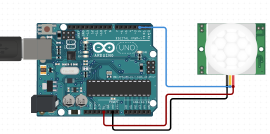

# C0002-Motion sensor

## Introduction

- Motion sensors are devices used to detect and measure movement. They are commonly used in home and business security systems, but can also be found in phones, paper towel dispensers, game consoles, and virtual reality systems.

## Image

## How to connect to a circuit

- The specific instructions for connecting a motion sensor to a circuit will depend on the type of motion sensor being used and the circuit being built. Generally, motion sensors will have pins or wires for connecting to power (usually 5V or 3.3V), ground, and a digital input pin on a microcontroller (such as an Arduino). It's important to consult the datasheet for the specific motion sensor being used and follow the manufacturer's instructions.

## The theory behind the components

- Motion sensors typically consist of three major components: a sensor, an embedded computer, and hardware. Active sensors have both a transmitter and receiver, and detect motion by measuring changes in the amount of sound and radiation reflecting back into the receiver. Passive sensors, on the other hand, detect motion based on a perceived increase of radiation in its environment. The most widely used type of passive motion sensor is the passive infrared (PIR) sensor, which detects the infrared radiation emitted naturally from the human body.

## Features

- Motion sensors can be customized to perform highly specific functions, such as activating floodlights, triggering audible alarms, activating switches, and even alerting the police. There are different types of motion sensors, including active and passive sensors, and different technologies used to detect motion, such as ultrasonic, microwave, and thermographic sensors.

## Statistics

- There is no specific statistic related to motion sensors as a whole, as their use and effectiveness will depend on the specific application and environment they are used in. However, motion sensors are widely used in home and business security systems, and have been shown to be effective in deterring burglars and intruders.
