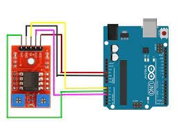

# C0013-Position sensor

## Introduction to position sensor,
A position sensor is a device that detects and measures the physical position or displacement of an object. These sensors are used in a variety of applications where it is essential to monitor the movement, location, or alignment of objects or systems. Position sensors provide valuable data for control systems, automation, and feedback mechanisms. There are several types of position sensors, each designed for specific applications and measurement requirements. Here are some common types of position sensors:

## 1. Potentiometers:
Potentiometers, or pots, are variable resistors that change resistance as the object they are attached to moves. The change in resistance is proportional to the displacement, providing an analog signal indicating the position.

## 2. Optical Encoders:
Optical encoders use light and sensors to measure the position of rotating objects. The encoder disc has patterns of light and dark regions, and as the object rotates, the sensor detects these patterns, converting them into position data.

## 3. Hall Effect Sensors:
Hall effect sensors measure the magnetic field around an object. Changes in the magnetic field due to movement are detected and converted into positional information. Hall effect sensors are often used in automotive applications.

## 4. Linear Variable Differential Transformers (LVDTs) and Rotary Variable Differential Transformers (RVDTs):
LVDTs and RVDTs are electromechanical sensors that provide highly accurate and precise position measurements. They work based on the electromagnetic induction principle and are commonly used in industrial and aerospace applications.

## 5. Inductive Sensors:
Inductive sensors use electromagnetic induction to detect the position of metallic objects. These sensors are contactless and are often used in industrial automation.

## 6. Ultrasonic Sensors:
Ultrasonic sensors emit ultrasonic waves and measure the time it takes for the waves to bounce back after hitting an object. By calculating the time delay, the distance (and consequently, position) of the object can be determined.

## 7. Capacitive Sensors:
Capacitive sensors measure changes in capacitance when an object enters the sensor's field. These sensors are often used for proximity sensing and can detect the presence or absence of an object, indicating its position.

## 8. Resistive Strip Sensors:
Resistive strip sensors are thin resistive strips mounted on a substrate. As the object moves across the strip, the resistance changes, providing position information. These sensors are used in applications where space is limited.

## Applications of Position Sensors:
Robotics: Position sensors are used in robotic systems to monitor the position and movement of robotic arms and joints.

## Automotive:
Position sensors are used in vehicles for applications such as throttle position sensing, gear shifting, and suspension system monitoring.

#3 Industrial Automation: 
Position sensors play a vital role in industrial automation, ensuring precise control of machinery and manufacturing processes.

## Aerospace:
Position sensors are used in aircraft and spacecraft for flight control surfaces, landing gear, and other critical components.

## Medical Devices:
Position sensors are used in medical equipment for applications like patient positioning, robotic surgeries, and prosthetics.

## Gaming and Virtual Reality:
Position sensors are used in gaming controllers and virtual reality systems to track movement and gestures.

Position sensors are essential components in modern technology, enabling accurate and reliable measurements that are fundamental to various industries and applications.

## How to connect Position Sensor to a Circuit

- Position sensors can be connected to a circuit in different ways depending on the specific sensor being used and the application it is being used for.
- In general, most position sensors will have at least two connections, which are typically power and ground.
The output of the sensor may be analog or digital, depending on the type of sensor used.
-Wiring a Linear Potentiometer Position Sensor
A linear potentiometer position sensor is a type of variable resistor that changes resistance as the object being measured moves linearly.

## Image

## To connect a linear potentiometer position sensor to an Arduino circuit, follow the steps below

### Linear Potentiometer Position Sensor Circuit Diagram

- Connect the GND pin on the linear potentiometer to the GND pin on the Arduino.
- Connect the VCC pin on the linear potentiometer to the 5V pin on the Arduino.
- Connect the wiper pin on the linear potentiometer to an analog input pin on the Arduino (e.g., A0).
- Add a 10k resistor between the wiper pin and the VCC pin on the potentiometer to create a voltage divider.
- Upload the code to the Arduino that will read the analog voltage on the analog input pin and convert it to a position measurement.
- Wiring a Rotary Encoder Position Sensor
A rotary encoder position sensor is a type of sensor that measures the rotation of an object.

## To connect a rotary encoder position sensor to an Arduino circuit, follow the steps below

- Rotary Encoder Position Sensor Circuit Diagram
- pin 1 = Vdd - 5v dc
- pin 2 = Ground
- pin 3 = _SS, is a 5v tolerant digital input
- pin 4 = SCLK, is a 5v tolerant digital input
- pin 5 = MOSI, is a 5v tolerant digital input/output
- pin 6 = Ground
- pin 7 = Vdig
- pin 8 = Ground
- note: pin 1 and pin 7 connect with Ground with capacitor.
 This is a basic circuit diagram and the actual connections may vary depending on the specific sensor being used and the application it is being used for.

- Always refer to the datasheet or manufacturer's instructions for the correct wiring and usage of the sensor.
