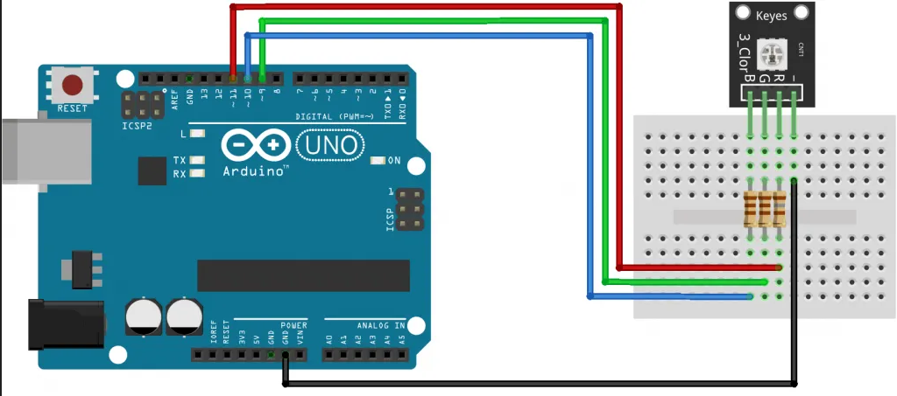

# C0021-RGB SMD Module

The KY-009 RGB Full color LED module is a compact and versatile device that allows you to emit a range of colors by mixing red, green, and blue light. The color of the LED can be adjusted using PWM and is compatible with popular electronics platforms like Arduino, Raspberry Pi, and ESP32.

## Image

## How to Connect to a Circuit

To connect the KY-009 module to an Arduino circuit, follow these steps:

- Connect the red pin (R) to Pin 9 on the Arduino.
- Connect the green pin (G) to Pin 10 on the Arduino.
- Connect the blue pin (B) to Pin 11 on the Arduino.
- Connect the ground pin (-) to GND on the Arduino.
- Use resistors between the board and the Arduino to prevent LED burnout.

-Refer to the following table for the recommended resistors to use

|KY-009|Breadboard|Arduino|
|--------|-----------|------------|
|R|180 ohm resistor|Pin 9|
|G|110 ohm resistor|Pin 10|
|B|110 ohm resistor|Pin 11|

## Theory Behind the Components

The KY-009 module consists of a 5050 SMD LED that emits different colors by mixing red, green, and blue light. The color of the LED can be adjusted using PWM, which controls the brightness of each color component. By adjusting the duty cycle of each PWM signal, different colors can be generated.

## Features

- Compact and versatile module that can emit a range of colors
- Adjustable color using PWM
- Compatible with popular electronics platforms like - - Arduino, Raspberry Pi, and ESP32
- Consists of a 5050 SMD LED and 4 male header pins
- Operating voltage: 5V max, Red 1.8V2.4V, Green 2.8V3.6V, Blue 2.8V~3.6V
- Forward current: 20mA~30mA
- Operating temperature: -25C to 85C
- Board dimensions: 18.5mm x 15mm

## Statistics

The KY-009 module operates at a maximum voltage of 5V and requires a forward current of 20mA~30mA. The module can operate in temperatures ranging from -25C to 85C and has a board size of 18.5mm x 15mm. Using the recommended resistors, the module can be safely connected to an Arduino circuit to prevent LED burnout.
