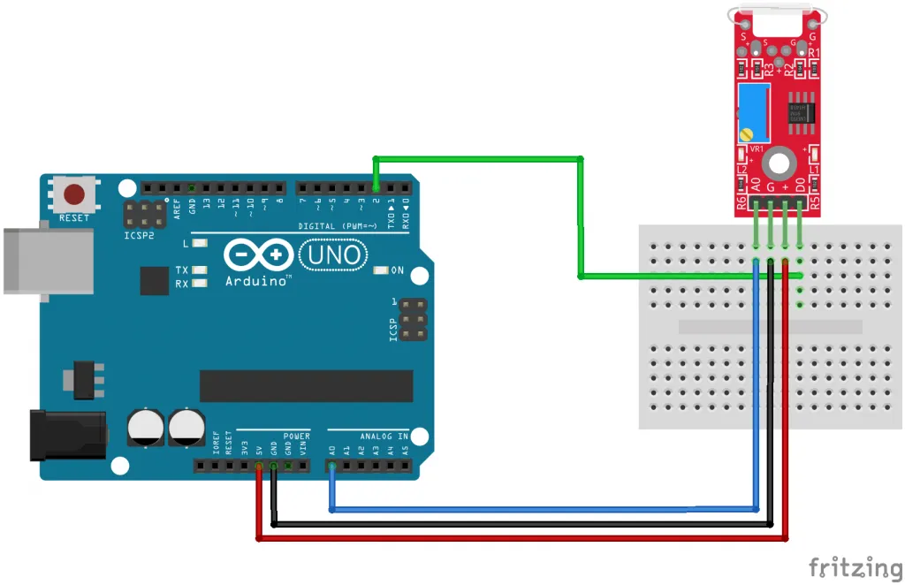

# C0043-Read Switch Module

The Mini Reed Switch Module is a mechanical switch that can be activated by a magnet when it is in proximity to the switch. It is commonly used in home security systems where it can detect when a window or door is opened.

## Image

## How to connect to a circuit

The GND pin of the module should be connected to the ground of the external circuit, and the 'S' output pin should be connected to an input pin of the microcontroller or other electronic device. The third unmarked pin in the center is connected to a 10K pull-up resistor, which can be tied to VCC or enabled as an internal pullup on the input pin.

## The theory behind the components

Reed switches are mechanical switches that are activated by a magnetic field. When a magnet is brought close to the glass envelope, the magnetic field pulls the metallic switch contacts together, closing the switch. This change in state can be detected by an MCU.

## Features

- The Mini Reed Switch Module is a single-pole single-throw (SPST) switch with normally open (NO) contacts. 
- The output is high when the switch is open and is grounded (low) when the contacts are closed. 
- The module is small and easy to integrate into a variety of electronic projects.

## Statistics

- The module typically operates at a voltage of 5V and has a maximum current rating of 0.5A. 
- The pull-up resistor connected to the unmarked pin has a resistance of 10K ohms. 
- The module is sensitive to magnetic fields and can detect the presence of a magnet from a distance of a few millimeters.
