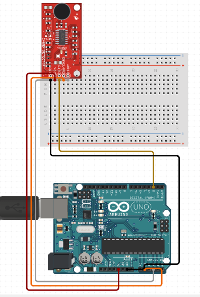

# C0012-Sound sensor

## Introduction to sound sensor,

A sound sensor, also known as a sound detector or sound sensor module, is an electronic device that is capable of detecting sound waves and converting them into electrical signals. These sensors are commonly used in various applications where the detection or measurement of sound is required. Sound sensors are crucial components in many electronic systems, enabling devices to respond to auditory cues or detect sound levels in the surrounding environment. Here are some key points about sound sensors:

## How Sound Sensors Work,
Sound sensors typically consist of a microphone element that captures sound waves and converts them into electrical signals. These signals can then be amplified and processed by electronic circuitry. The sensitivity of the sensor determines its ability to detect different levels of sound.

## Types of Sound Sensors,
Analog Sound Sensors: Analog sound sensors provide an analog voltage or current output that varies proportionally with the sound level detected. The output signal can be processed by microcontrollers or other analog electronics.

## Digital Sound Sensors: 
Digital sound sensors provide a binary output (high/low) based on a predefined sound threshold. When the sound level exceeds the set threshold, the sensor triggers a digital signal, indicating the presence of sound.

## Applications of Sound Sensors,

## Security Systems:
Sound sensors are used in security systems to detect abnormal sounds, such as glass breaking or alarms, triggering appropriate responses.

## Home Automation:
Sound sensors can be integrated into smart home systems to respond to voice commands or detect specific sounds within the home environment.

## Industrial Applications:
Sound sensors are used in industrial automation to monitor machinery and equipment. Unusual sounds can indicate mechanical issues or malfunctions.

## Noise Pollution Monitoring:
Sound sensors are employed in environmental monitoring systems to measure noise pollution levels in urban areas. This data is used for city planning and noise regulation purposes.

## Robotics:
Sound sensors are used in robots to enable them to respond to voice commands or to detect specific sounds, allowing for interactive and responsive behavior.

## Consumer Electronics:
Sound sensors are used in devices like voice-activated assistants, toys, and gadgets to detect voice commands or specific sound patterns.

## Automotive:
Sound sensors can be used in vehicles for hands-free calling, noise cancellation, or to trigger alarms based on specific sounds, such as honking or sirens.

## Healthcare:
Sound sensors can be used in medical devices for monitoring patient breathing patterns or detecting specific medical alarms, indicating critical situations.

Sound sensors play a vital role in enhancing the functionality and interactivity of various electronic systems, making them responsive to auditory cues and enabling a wide range of applications across different industries.

## Image

## How to connect to a circuit

To connect a Sound Sensor to a circuit, you need to connect the following components:

- The VCC pin of the module to the positive (+) rail of the breadboard.
- The GND pin of the module to the negative (-) rail of the breadboard.
- The DOUT pin of the module to a digital input pin of the Arduino.
- The AOUT pin of the module to an analog input pin of the Arduino.
- The theory behind the components
- The microphone detects sound waves and converts them to an analog signal, which is fed into an op-amp for amplification and conversion to a digital or analog output. The potentiometer on the module allows you to adjust the sound level set point.

## Features

Some of the key features of a Sound Sensor include:

- Detects sound waves in a particular area
- Converts the signal to a digital or analog output
- Adjustable sound level set point via a potentiometer
- Can be used for a variety of applications, such as turning lights on and off with clapping or detecting the presence of sound in an environment

## Statistics

- Sound sensors are widely used in the fields of security, automation, and entertainment.
- They can be used to detect and monitor sound levels in an environment, which can be useful in ensuring the safety and security of people and property.
- Sound sensors are also used in the entertainment industry for recording and amplifying sound.
