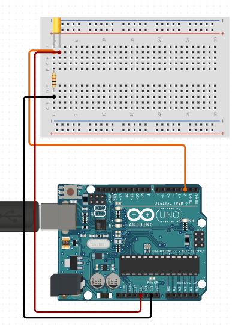

# C0018-Tilt Sensor

Tilt sensors are transducers that produce an electrical signal proportional to the degree of inclination with respect to one or more axes. These sensors play a critical role in several applications such as off-road vehicles, portable computers, robotics devices, aviation instruments, etc. One of the critical applications of tilt sensors is in the aviation industry, where they assist pilots in navigating through the obstacles during the flight.

## Image

## How to Connect to a Circuit

Tilt sensors are connected to a circuit using digital output pins. These pins produce an electrical signal that varies with the angular movement of the sensor. Tilt sensors are compatible with an operating voltage of 3.3V5V, and they have a sensitivity range of 1545 degrees.

## Theory Behind the Components

Tilt sensors consist of a rolling ball with a conductive plate beneath it. When the sensor is powered, the rolling ball falls to the bottom of the sensor to form an electrical connection. When the sensor is tilted, the rolling ball does not fall to the bottom, and the current cannot flow between the two end terminals of the sensor. Thus, the degree of tilt is directly proportional to the electrical output signal of the sensor.

## Features

- Tilt sensors produce an electrical signal proportional to the degree of inclination with respect to one or more axes.
- These sensors are used to measure slope and tilt within a limited range of motion.
- Tilt sensors are available in different types, such as force balance sensor, MEMS sensor, and fluid-filled sensor.
- These sensors are compatible with an operating voltage of 3.3V5V, and they have a sensitivity range of 1545 degrees.

  - Applications of Tilt Sensor
  - Cameras
  - Video Cameras
  - Aircraft Flight Control
  - Construction Equipment
  - Robotic Technology
  - Automobile Air Bags
  - Video Game Controllers
  - Studying Human Movement
  - Thermostats
  - Automobile Security System

## Statistics

| | |
| -------------- | --------------- |
|I/O Pins       |Digital Output|
|Length x Width|30mm x 16mm|
|Operating Voltage |3.3V~5V|
|Sensitivity|15~45 degrees|
