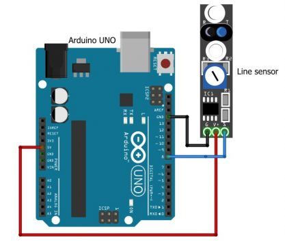

# C0017-Tracking Sensor

## Introduction

- The KY-033 Line Tracking Sensor is a simple device that tracks black lines against a white background or white lines against a black background. It is also known as a hunt sensor or line following sensor. This sensor uses IR technology to detect the lines and can be easily interfaced with microcontrollers like Arduino.

## Image

## How to Connect to a Circuit

To connect the KY-033 Line Tracking Sensor to a circuit, follow these steps:

- Connect the output pin of the sensor with digital pin 8 of the Arduino.
- Connect the ground of the sensor with the ground of the Arduino.
- Connect the VCC pin of the sensor with the 5V pin of the Arduino.

## Theory behind the Components

- The KY-033 Line Tracking Sensor consists of IR technology that uses a built-in receiver and transmitter to sense IR energy and detect the obstacle in front of the sensor module. The sensor returns the status of the IR light reflected from the surface.
- When the sensor is on a black surface, all of the radiation that is transmitted gets absorbed by the surface, and nothing is reflected onto the sensor, resulting in a zero output signal. When it is on a white surface, all the radiation that is transmitted off the transmitter is being detected by the receiver, and then we get a positive signal or digital one.
- The sensor has a knob that can be adjusted from one to three to adjust the sensitivity of the line tracking sensor.

## Features

Some of the features of the KY-033 Line Tracking Sensor are:

- Working voltage: DC 3.3V-5V
- Working Current: >=20mA
- Operating Temperature: -10C~+50C
- Detection distance: 2-40cm
- IO interface: 3-Wire interfaces
- Output Signal: TTL level
- Adjustment: adjust multi-turn resistance.
- Effective angle: 35`

## Statistics

- The KY-033 Line Tracking Sensor has integrated onboard a line tracker, onboard built-in potentiometer which will be used to adjust the direction range, one micrometer, four resistors, and one LED. The potentiometer is used to calibrate the sensor. The sensor has very good ambient response even in complete darkness. The resistor R1 used in this module is 1.5K ohms, resistor R3 is 10K ohms, resistor R4 is 220 ohms, and resistor R5 is 10K ohms, and the main reason for using the resistor is to limit current circulating inside the module. The blue LED on the module blinks when the sensor detects an obstacle.
