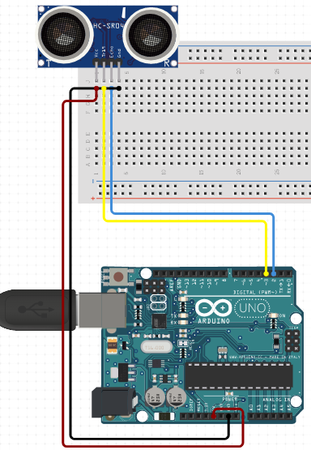

# C0015-Ultrasonic Distance Sensor

## Introduction

- The HC-SR04 ultrasonic distance sensor is a commonly used sensor for measuring distances from 2cm to 400cm (about an inch to 13 feet).
- It works based on the principle of sending and receiving ultrasonic sound waves, similar to SONAR used in submarines. The sensor is affordable, easy to use, and provides accurate distance measurements with a high resolution of 3mm.

## Image

## How to connect to a circuit

- To connect the HC-SR04 ultrasonic distance sensor to an Arduino or other microcontroller, you need to connect the VCC and GND pins to the 5V and GND pins on the board respectively.
- You also need to connect the Trig and Echo pins to any digital input/output pins on the board.

## The theory behind the components

- The HC-SR04 ultrasonic distance sensor works by sending an ultrasonic sound wave at a frequency of 40000Hz, which travels through the air and bounces back to the sensor when it encounters an obstacle or object.
- The sensor then calculates the distance based on the travel time of the sound wave and the speed of sound.

## Features

The HC-SR04 ultrasonic distance sensor has the following features:

- Operating voltage: 5V DC
- Operating current: 15mA
- Operating frequency: 40kHz
- Minimum range: 2cm/1 inch
- Maximum range: 400cm/13 feet
- Accuracy: 3mm
- Measuring angle: 15 degrees
- Dimension: 45 x 20 x 15mm

## Statistics

- The HC-SR04 ultrasonic distance sensor is a widely used sensor in robotics, automation, and other applications that require accurate distance measurements. It is easy to use, affordable, and provides accurate measurements with a high resolution of 3mm.
