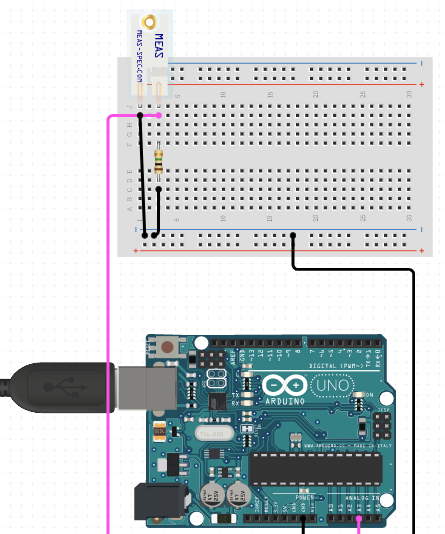

# C009-The Vibration sensor

A vibration sensor is an electronic device that is used to detect vibrations in a machine or equipment. It helps in identifying any continuous vibration or jerks that could lead to damages in critical machines or expensive equipment. The SW-420 vibration sensor is a cheap and dedicated sensor that detects vibration using LM393 comparator and provides digital output.

## Image

## How to connect to a circuit

To connect the SW-420 vibration sensor module to an Arduino, follow these steps:

- Connect the VCC pin of the module to the 5V pin on the Arduino.
- Connect the GND pin of the module to the GND pin on the Arduino.
- Connect the DO pin of the module to any digital pin on the Arduino, such as D2.
- Connect a LED to the digital pin D13 and GND.

## The theory behind the components

The SW-420 vibration sensor module uses an LM393 comparator to detect vibrations over a threshold point and provide digital data. When the vibration is detected, the sensor provides logic high output, and when there is no vibration, the sensor provides logic low output. The potentiometer available on the module can be used to control the threshold point of the vibration.

## Features

Some common features of the SW-420 vibration sensor module include:

- Cheap and dedicated vibration sensor
- LM393 comparator used to detect vibration
- Potentiometer available to control threshold point
- Digital output provided when vibration is detected

## Statistics

- The accuracy of the vibration sensor can vary depending on the type of sensor used and the environment it is used in. 
- However, a good quality vibration sensor can provide accurate results and help in identifying any continuous vibration or jerks that could lead to damages in critical machines or expensive equipment. 
- The lifespan of a vibration sensor can range from a few months to several years, depending on the type of sensor and its usage.
